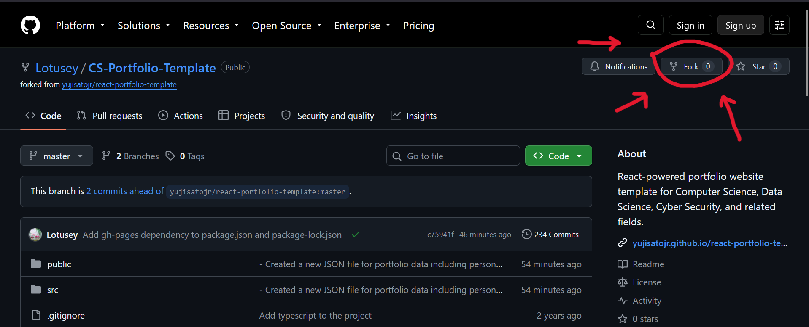
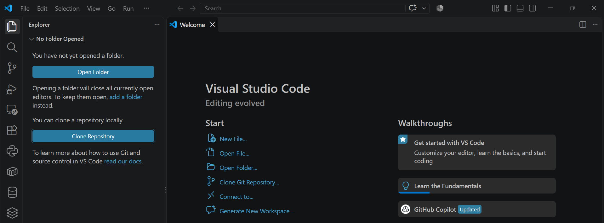
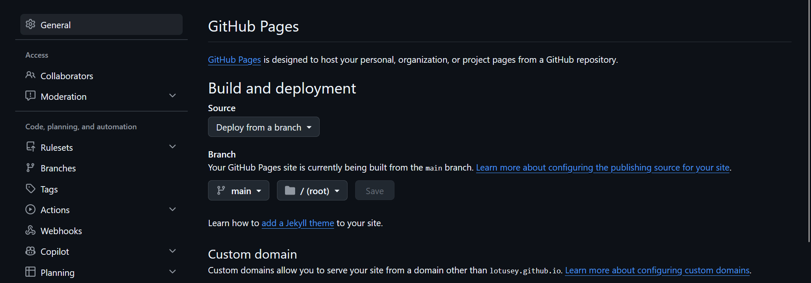

# ME-Portfolio-Template
Portfolio website template for Mechanical, Civil, Aerospace, etc. Engineers

## CAD model library

The library is kept at the repository root so it is published correctly by GitHub Pages. Viewer URLs are resolved relative to the site, including when Pages hosts the site below a repository-name path.

## What is this?

This simple portfolio template is designed to showcase your past projects, career history, skill sets, and more.

View the [Demo](https://lotusey.github.io/ME-Portfolio-Template/).

**This template is free to use, and no attribution is required.** You can fork or download this repository to customize it for your own use.

## Features

✅ Open source (free to use, no attribution required)  
✅ Responsive design & mobile-friendly   
✅ Highly customizable multi-component layout  
✅ Built with HTML & CSS  
✅ Able to display 2D & 3D CAD Models

## Quick Setup

1. Set up a GitHub Account:
    - Visit GitHub: If you don't have an account, go to [GitHub](https://Github.com) and sign up.
    - Create an Account: Fill out the registration form with your preferred username, email, and password. Since your username will be the start of your web page's handle, try to make your username your name, or something easily read aloud. 
    - Verify Your Email: Check your email to verify your account

2. Using the Template:
    - Navigate to the [ME-Portfolio-Template](https://github.com/Lotusey/ME-Portfolio-Template) Repository.
    - Click on the "Fork" button on the top right. 
    
    - Choose the owner (you), name the repository "(username).github.io", and add a description. 
     
    - Now the repo should be forked!

3. Open VSCode (or your code editor of choice) and clone the repo. 
    - If not already connected, log in to GitHub via VSCode by clicking on the account icon in the bottom left of the window. 
    - Once logged in, Click on the "Explorer" tab in the top left > "Clone Repository" > Clone from GitHub > Select "(Username)/(Username).github.io ..."
    
    - Now you should have the repository cloned locally and the workspace open.

4. Open `script.js` and replace the example information with your own. The page updates from this file; you do not need to edit any other components. 

The script file contains your name and title, social links, expertise and technologies, experience, projects, and contact-section text. 

Add your CAD Models to `models/2d/` and `models/3d/`. The CAD Viewer accepts `.dwg` or `.dxf` for 2D modeling and `.glb`, `.stl`, or `.obj`. 
Then lastly, make sure to add each file to `models/catalog.json` using a path relative to the site root, such as `models/2d/plate-layout.dxf`

## Deployment

Now we'll host the website via GitHub pages!
(You can also choose a different preferred service (e.g., [Netlify](https://www.netlify.com/), [Render](https://render.com/), [Heroku](https://www.heroku.com/)) for deployment, but GitHub pages is the easiest for our purposes.) Follow the instructions below for a production deploy.

1. Ensure project settings in GitHub
    - Go back to the repository on GitHub
    - Go to settings > Pages
    - Then under Build and Deployment and under Branch select 'main' and press Save
    

2. **Access Your Deployed App**

    After successfully deploying, you can access your app at `https://yourusername.github.io/your-repo-name`.